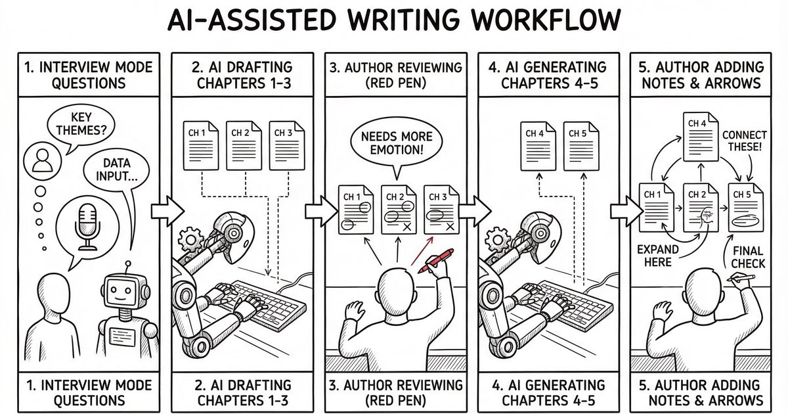

# WP Article AI Workflow（IT Monk）

AI Agent 驅動的 WordPress 內容自動化系統，支援兩種工作模式：

| 模式 | 說明 |
|------|------|
| **單篇自動發文** | 主題 → 搜尋文獻 → 產文 → 插圖 → 縮圖 → 發布 |
| **長篇連載內容** | 小說 / 技術教學 / 深度報導的多單元連載創作與逐章發布 |

完整 Skill 規格見 [`SKILL.md`](SKILL.md)（索引）→ [`skills/`](skills/)。

---

## 專案說明

這個 repo 的定位是「**AI 產出內容/圖片 → 一鍵落地到 WordPress**」的工作流工具箱：

- 你可以用任何 AI Agent（Claude / Codex / Cursor）產出文章 HTML、插圖計畫 JSON、縮圖/插圖 prompts
- 再用這個 repo 提供的 CLI 把成果**穩定地**完成「產圖 → 壓縮 → 插入文章 → 上傳媒體 → 發布/更新文章」

下圖是一個可用範例（同 repo 也包含對應的 HTML / 插圖計畫 / 圖檔）：



---

## 範例 prompt（Agent 對話 / 指令）

下面這些不是「圖片 prompt」，而是你可以直接丟給 Claude / Codex / Cursor 的「工作指令」。輸出物會對應到本 repo 的檔案與 CLI（例如：`article-drafts/<slug>.html`、`*-illustration-plan.json`、`pnpm wp:publish-post`）。

### 開啟 interview 模式：我想寫一篇關於 AI 的小說

> 開啟本專案的 interview 模式，我想寫一篇關於 AI 的小說。請用問題引導我釐清：世界觀、主角弧線、章節大綱、風格與禁忌。最後輸出：
> - 系列/文章的 slug 建議（英文小寫 + 連字號）
> - 章節/文章大綱（h2/h3）
> - `article-drafts/<slug>.html`（內容片段 HTML，不要 `<!DOCTYPE>`/`<html>`/`<head>`/`<body>`）
> - 插圖計畫 `article-drafts/<slug>-illustration-plan.json`

### 開啟 interview 模式：我想寫一個個人工作流程分享

> 開啟本專案的 interview 模式，我想寫一個我個人工作流程的分享。請先問我目前工具鏈、痛點、衡量指標、讀者對象與案例。最後輸出：
> - 文章標題（3 個候選）
> - slug 建議
> - `article-drafts/<slug>.html`
> - 用於縮圖的描述（英文一句話即可，之後可丟給 `pnpm ai:generate-thumbnail`）

### 文章完成後：出動 `agents/` 幫我潤稿

> 文章已完成在 `article-drafts/<slug>.html`。請使用本專案的 `agents/editing-assistant.md` 規格幫我潤稿：改善結構、可讀性、節奏、避免贅字，並保留技術正確性。輸出更新後的 HTML（仍然是內容片段）。

### 幫我規劃 XXX 的文章插圖

> 請幫我規劃這篇文章的插圖：主題是「XXX」。限制：最多 3 張、避免血腥/侵權/品牌 logo、以清楚傳達概念為主。請輸出符合本專案格式的插圖計畫 JSON：
> `{ "style": "...", "illustrations": [ { "insertAfterBlockIndex": 0, "prompt": "...", "altText": "..." } ] }`
> 並說明每張插圖應該插在文章哪一段之後（用 `insertAfterBlockIndex` 對齊）。

### 幫我發布成草稿：tag / 分類幫我想一下

> 這篇文章在 `article-drafts/<slug>.html`，縮圖在 `article-drafts/<slug>.jpg`。請先建議：
> - 1～2 個分類（category）名稱與 slug
> - 5～10 個 tag（中英文都可，但給我最終用在 WP 的 slug 建議）
> 然後給我一段可直接執行的發布指令（先用 draft）：
> `pnpm wp:publish-post --title "..." --content-file ./article-drafts/<slug>.html --status draft --slug "<slug>" --thumbnail ./article-drafts/<slug>.jpg --categories "1,2" --tags "3,4,5"`
> （如果不知道 id，先提醒我用 `pnpm wp:get-tags` 查 id 再補上）

## 深度整合重點

- **WordPress**：透過 WordPress REST API（Basic Auth / Application Password）讀取 Tag/Category、上傳媒體、建立/更新文章，並支援將文章 HTML 內的相對路徑圖片自動上傳到媒體庫再替換連結。
- **Gemini API**：用於產生縮圖與插圖（prompt 驅動），並可搭配參考圖維持系列角色/畫風一致。
- **Pexels API**：搜尋攝影圖庫作為圖片來源，支援橫向篩選、最小寬度 1200px、同篇去重與 rate limit 提示。同一篇文章可混合使用 Gemini 與 Pexels。
- **影像處理（Sharp）**：縮圖壓縮、尺寸調整，讓發文圖片更符合網頁載入需求。

---

## 需求

- **Node.js** 18 或以上（建議 LTS）
- **pnpm**

---

## 快速開始

```bash
# 安裝依賴（建議使用 Corepack 管理 pnpm）
corepack enable
pnpm install

# 複製環境變數範本並填入實際值（勿提交 .env）
cp .env.example .env

# 驗證設定是否讀取成功
pnpm test:config
```

輸出 `SITE: ok` 表示已能從 `.env` 讀取設定。

---

## 典型使用情境

- **內容團隊每日自動發文**：固定題目欄位與素材來源，批次產文、產縮圖、上傳發布（或先存 draft 交由編輯審稿）。
- **長篇連載（小說/課程/深度報導）**：每章有獨立封面與插圖計畫，逐章發布並維持一致風格。
- **既有文章更新**：依 slug 更新內容與縮圖，並自動處理文內圖片上傳與連結替換。
- **只把 AI 當工具鏈的一段**：你也可以只使用「縮圖/插圖」或「上傳發文」其中一段，拼成自己的 workflow。
- **快速看一個可跑的範例**：`article-drafts/ai-novel-workflow-last-verification.html` + `article-drafts/ai-novel-workflow-last-verification-illustration-plan.json`（同資料夾也包含縮圖與插圖檔）。

---

## 環境變數

| 變數 | 必填 | 說明 |
|------|------|------|
| `SITE` | 是 | WordPress 網站網址（例：`https://it-monk.com`） |
| `USER_NAME` | 是 | WordPress 使用者名稱 |
| `WP_APP_PASSWORD` | 是 | WordPress 應用程式密碼 |
| `GEMINI_API_KEY` | 是 | Google Gemini API 金鑰（產圖） |
| `ILLUSTRATION_ENABLED_DEFAULT` | 否 | 是否預設開啟插圖（預設 `true`） |
| `ILLUSTRATION_MAX_PER_ARTICLE` | 否 | 每篇文章最多插圖數（預設 `3`） |
| `ILLUSTRATION_DEFAULT_STYLE` | 否 | 插圖預設風格描述（英文） |
| `ILLUSTRATION_STRICT_MODE` | 否 | 為 `true` 時任一幅插圖失敗即中斷（預設 `false`） |
| `PEXELS_API_KEY` | 否* | Pexels API 金鑰（使用圖庫來源時必填） |
| `PEXELS_ATTRIBUTION_DEFAULT` | 否 | Pexels 圖是否在 figcaption 顯示署名（預設 `true`） |

### 取得 `WP_APP_PASSWORD`（WordPress Application Password）

1. 用管理者或具備權限的帳號登入 WordPress 後台（`/wp-admin`）。
2. 進入「**使用者 → 個人資料**」（或「Users → Profile」）。
3. 找到「**Application Passwords / 應用程式密碼**」區塊。
4. 在「New Application Password Name」輸入用途（例如：`wp-article-ai-workflow`），按下「Add New / 新增」。
5. 複製產生出來的密碼，填入 `.env` 的 `WP_APP_PASSWORD`。

注意：

- **只會顯示一次**：產生後請立即複製保存；遺失就刪掉重建一組。
- **建議單一工具一組密碼**：方便日後撤銷（只要刪掉該組 Application Password）。

詳見 [`.env.example`](.env.example)。

---

## 所有可用指令

### WordPress 工具

| 指令 | 說明 |
|------|------|
| `pnpm wp:get-tags` | 讀取站點所有 Tag 與 Category（含 id） |
| `pnpm wp:create-category` | 新增 WordPress Category |
| `pnpm wp:publish-post` | 發布或更新單篇文章（見下方說明） |

#### `wp:create-category` 參數

```bash
pnpm wp:create-category --name "<名稱>" [--slug <slug>] [--parent <id>] [--description "<說明>"]
```

#### `wp:publish-post` 參數

```bash
# 新文章
pnpm wp:publish-post \
  --title "<標題>" --content-file ./article-drafts/<slug>.html \
  --status publish --slug "<slug>" \
  --thumbnail ./article-drafts/<slug>.jpg \
  --categories "1,2" --tags "3,4,5"

# 更新既有文章
pnpm wp:publish-post --update-slug "<既有 slug>" \
  --content-file ./article-drafts/<slug>.html \
  --thumbnail ./article-drafts/<slug>.jpg
```

---

### AI 產圖工具

| 指令 | 說明 |
|------|------|
| `pnpm ai:generate-thumbnail` | 依 `--image-source`（gemini／pexels）產圖並以 Sharp 壓縮 |
| `pnpm ai:add-illustrations` | 依插圖計畫為單篇文章插圖（可混合來源；可 `--strict`） |

```bash
pnpm ai:generate-thumbnail --prompt "<英文描述>" --out ./article-drafts/<slug>.jpg
# （可選）帶參考圖，維持角色/畫風一致（可逗號分隔多張，僅 Gemini）
pnpm ai:generate-thumbnail --prompt "<英文描述>" --reference "./path/to/ref.jpg" --out ./article-drafts/<slug>.jpg
# Pexels 圖庫
pnpm ai:generate-thumbnail --image-source pexels --pexels-query "<關鍵字>" --out ./article-drafts/<slug>.jpg

pnpm ai:add-illustrations --article ./article-drafts/<slug>.html --plan <計畫.json>
pnpm ai:add-illustrations --article ./article-drafts/<slug>.html --plan <計畫.json> --strict
```

> **建議**：若是某個連載系列的封面或插圖，請先檢查該系列設定檔（`article-drafts/<series-slug>-series/_<series-slug>-series-config.md`）中的 `art_style.cover_style` / `art_style.illustration_style`，並以此為主體組合 prompt；除非有特別需求，不要自行改變畫風或加入互相衝突的風格描述。

---

### 長篇連載工具

| 指令 | 說明 |
|------|------|
| `pnpm series:init` | 初始化連載系列（資料夾、設定檔、WP Category） |
| `pnpm series:publish` | 發布單一章節 / 課程 / 集數到 WordPress |
| `pnpm series:add-illustrations` | 依系列 Art Bible 風格為章節插圖 |

#### `series:init` 參數

```bash
pnpm series:init \
  --slug <系列-slug> \
  --title "<標題>" \
  --type <novel|tutorial|investigative> \
  [--genre "<題材>"] [--theme "<主題>"] [--style "<文風>"] \
  [--source-mode <ai|interview>] \
  [--cover-style "<封面風格（英文）>"] \
  [--illustration-style "<插圖風格（英文）>"] \
  [--color-palette "<色調>"] [--mood "<氛圍>"] \
  [--skip-wp-category]
```

#### `series:publish` 參數

```bash
pnpm series:publish \
  --series <slug> --chapter <N> --title "<標題>" \
  --status <draft|publish> \
  [--tags "<id1,id2>"] [--summary "<本單元摘要>"] \
  [--skip-thumbnail] \
  [--update-slug "<既有 slug（更新模式）>"]
```

#### `series:add-illustrations` 參數

```bash
pnpm series:add-illustrations \
  --series <slug> --chapter <N> --plan <計畫.json 或 ->
# （可選）--reference "./path/to/ref.jpg" 以參考圖維持角色一致（可逗號分隔多張）
# （可選）--use-character-reference 套用 config.characters[].reference_image（預設不套用）
```

---

## 與各種 AI Agent / 工具鏈搭配

你可以把本專案當成「可被 Agent 呼叫的 CLI 工具箱」：Agent 負責規劃與產文，你用 CLI 做落地（產圖、插圖插入、發佈、更新）。

- **Claude CLI（Claude Code）**
  - 常見做法：讓 Claude 產出一份 `article-drafts/<slug>.html` 與縮圖/插圖 prompt，再直接呼叫 `pnpm wp:publish-post` 或 `pnpm ai:add-illustrations`。
- **OpenAI Codex（codex CLI）**
  - 常見做法：用 Codex 進行「資料蒐集/整理 → 文章草稿 → 插圖計畫 JSON」，然後用本 repo 的指令發布到 WordPress。
- **Cursor（IDE Agent）**
  - 常見做法：在 Cursor 內協作修改草稿 HTML、調整插圖計畫（`*-illustration-plan.json`），並在終端執行 `pnpm` 指令快速驗證與發布。

> 這些 Agent 之間差異在「產出內容/計畫」的能力；本專案負責把內容與圖片**穩定地**送到 WordPress，並保留一致的檔名/slug 慣例，利於後續更新與追蹤。

---

## 專案結構

```
wp-article-ai-workflow/
├── .env                          # 本機密鑰，不提交
├── .env.example
├── SKILL.md                      # Skill 索引
├── skills/
│   ├── auto-post.md              # 單篇自動發文流程規格
│   ├── interview.md              # Interview 模式（專訪式素材蒐集）
│   ├── series-writer.md          # 長篇連載內容模式規格
│   └── sub-skills/
│       ├── novel-idea.md         # 小說主題構思子技能
│       ├── curriculum-idea.md    # 技術教學課程構思子技能
│       └── story-angle.md        # 深度報導角度設定子技能
├── agents/
│   └── editing-assistant.md      # 潤稿 Agent（各模式皆可呼叫）
├── article-drafts/               # 單篇文章草稿與縮圖
│   └── <series-slug>-series/     # 連載系列草稿目錄
│       ├── _<slug>-series-config.md  # 系列設定檔（JSON）
│       ├── chapter-01.html
│       ├── chapter-01.jpg        # 封面
│       └── chapter-01-1.jpg      # 插圖
├── lib/
│   ├── config.js                 # 讀取 .env 設定
│   ├── wp-client.js              # WordPress REST API 封裝
│   ├── gemini-image.js           # Gemini 產圖
│   ├── image-source-registry.js  # Registry/Strategy：gemini、pexels
│   ├── strategies/
│   │   ├── gemini-strategy.js    # Gemini 來源策略
│   │   └── pexels-strategy.js    # Pexels 來源策略
│   ├── pexels-client.js          # Pexels Photos Search API
│   ├── fetch-image-buffer.js     # URL → Buffer 下載（timeout + retry）
│   ├── generate-thumbnail.js     # 經 registry 產圖 + Sharp 壓縮
│   ├── thumbnail-optimize.js     # Sharp 尺寸優化
│   ├── html-utils.js             # HTML 區塊切割、插圖插入、跳脫
│   ├── illustration-config.js    # 插圖設定（.env + rules）
│   ├── illustration-plan-utils.js # 插圖計畫共用解析
│   ├── parse-cli-args.js         # 共用 CLI 參數解析
│   └── series-config.js          # 連載設定讀寫工具
├── scripts/
│   ├── wp-get-tags.js            # 讀取 Tag / Category
│   ├── wp-create-category.js     # 建立 Category
│   ├── wp-publish-post.js        # 發布單篇文章
│   ├── generate-thumbnail.js     # 產圖 CLI
│   ├── add-illustrations.js      # 單篇插圖 CLI
│   ├── series-init.js            # 初始化連載系列
│   ├── series-publish.js         # 發布連載章節
│   └── series-add-illustrations.js  # 連載插圖 CLI
└── docs/
    ├── prd.md                    # 產品需求規格
    ├── illustration-rules.md     # 插圖排除規則
    └── article-ideas.md          # 文章發想清單
```

---

## Skill 文件

| Skill | 適用情境 |
|-------|----------|
| [`skills/auto-post.md`](skills/auto-post.md) | 單篇文章：主題 → 文獻 → 產文 → 插圖 → 縮圖 → 發布 |
| [`skills/interview.md`](skills/interview.md) | 專訪式對談挖掘素材，整理成大綱後銜接 auto-post |
| [`skills/series-writer.md`](skills/series-writer.md) | 連載：小說 / 技術教學 / 深度報導（支援走向調整、潤稿）|

---

## 附錄

- **Google Developer Console（建立/管理 API key）**：[Google Cloud Console](https://console.cloud.google.com/)

---

## 授權

MIT
